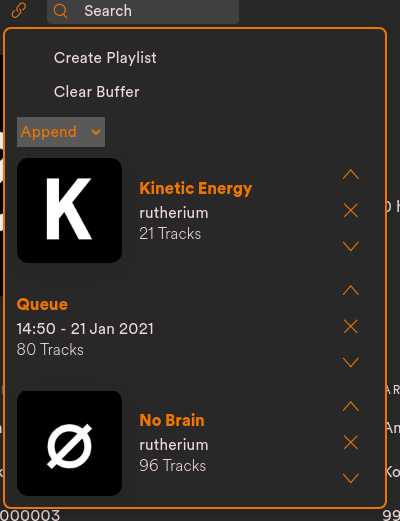

# Spicetify Copy

Spicetify extension which allows you to copyand combine playlists/queue directly in Spotify.

## Preview
Copy a single playlist:  

Combine multiple playlist to a single big playlist:  

Create a new playlist from Queue or copy into the buffer:  

## Important
When creating a new Playlist you **MUST** use the `Create` button, otherwise an empty playlist will be created.

## More
This extension is created by [@einzigartigerName](https://github.com/einzigartigerName) and hosted on GitHub [here](https://github.com/einzigartigerName/spicetify-copy/)
