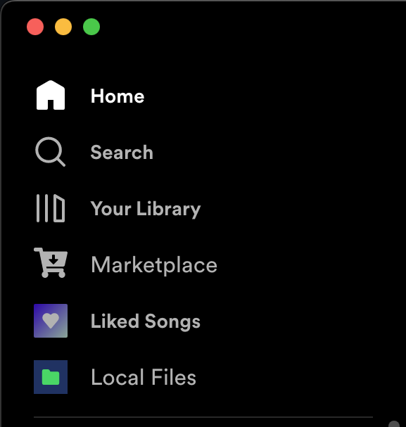

# Spicetify Show Local Files

Spicetify Extension which adds a sidebar shortcut to Local Files.

## Preview


## Installation
* Download and install [Spicetify](https://github.com/khanhas/spicetify-cli.git)
* Add the spicetify-show-local-files folder to the [CustomApps](https://spicetify.app/docs/advanced-usage/custom-apps) folder (spicetify-cli/CustomApps)
* Add the extension to your `config-xpui.ini` file
```shell
spicetify config custom_apps spicetify-show-local-files
spicetify apply
```

## Contribution
This extension is primarily maintained on [hroland/spicetify-show-local-files](https://github.com/hroland/spicetify-show-local-files/)

Help is appreciated, feel free to submit PRs. Making the current solution more sophisticated, and having the sidebar item stylistically follow the other GlueDropTarget elements would be the goal.
## Credits

Inspired by:
* [einzigartigerName/spicetify-history](https://github.com/einzigartigerName/spicetify-history)
* [theRealPadster/spicetify-hide-podcasts](https://github.com/theRealPadster/spicetify-hide-podcasts)
* [spicetify/spicetify-cli/CustomApps/reddit](https://github.com/spicetify/spicetify-cli/tree/master/CustomApps/reddit)
