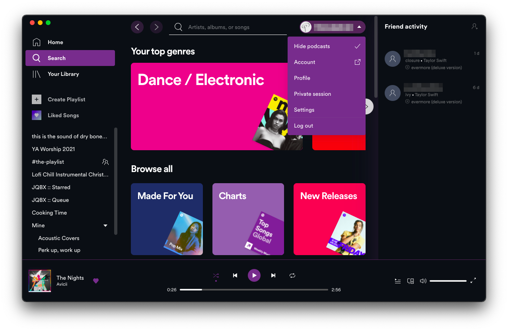

# spicetify-hide-podcasts
[Spicetify](https://github.com/khanhas/spicetify-cli) extension to hide podcasts. 
* Hides podcast carousels on the homepage
* Hides the podcasts tab on the Your Library page
* Hides the podcasts genre card on the Search page
* Also removes mention of podcasts in the search entry placeholder text

## Notes
This extension is created by [@theRealPadster](https://github.com/theRealPadster) and hosted on GitHub [here](https://github.com/theRealPadster/spicetify-hide-podcasts/). Please download from there, as the version in this repo is not guaranteed to be up to date. This version of the extension just supports the new xpui (Spicetify v2+), but the legacy Spicetify v1 version is available from the main GitHub repo. 

## Usage
Toggle in the Profile menu.

## More
🌟 Like it? Gimme some love!    

If you find any bugs or places where podcasts are still showing up, please [create a new issue](https://github.com/theRealPadster/spicetify-hide-podcasts/issues/new/choose) on the GitHub repo.    

