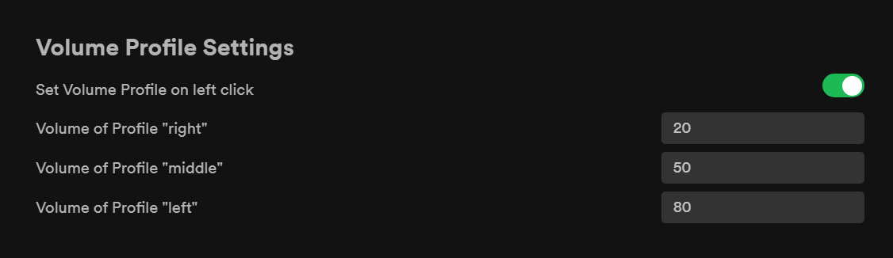

# Volume Profiles v2

###### Built with [Spicetify Creator](https://github.com/FlafyDev/spicetify-creator). Download from [Spicetify Marketplace](https://github.com/CharlieS1103/spicetify-marketplace).

[](https://github.com/notPlancha/Volume-Profiles-Spicetify-Extension-v2)

This is the upgraded version of [Volume-Profiles-Spicetify-Extension-v1](https://github.com/notPlancha/Volume-Profiles-Spicetify-Extension-v1), where it's more responsive, more extended, and more Spicy.

This exension is an extension for Spicetify-cli to save a volume to a profile, to load later when needed.

To install it just grab the js in the dist folder, and load it with spicetify. If you want to build it, clone it (or download it) and run

```
npm i
```

## Preview




## Notes

* This package uses uzairfarooq's [arrive.js](https://github.com/uzairfarooq/arrive) and franciscop's [umbrella js](https://github.com/franciscop/umbrella)

* It's possible that an update to spotify or spicetify will break your saved volumes, but I've yet to experience this. If this happens, try raising an issue on the github page
[create issue](https://github.com/user/repository/issues/new)
- Same thing for any other issue/bug

## More

- Check me out for possibly future extensions, star the repo if you liked it and watch the repo for updates

[](https://github.com/notPlancha)

[](https://github.com/notPlancha/Volume-Profiles-Spicetify-Extension-v2)

[](https://github.com/user/repository/subscription)


- If you have any suggestions, drop it on the [discussions page](https://github.com/notPlancha/Volume-Profiles-Spicetify-Extension-v2/discussions) or make a pull request

- version 2.1.1