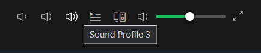
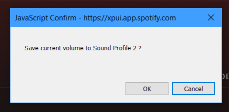

# Volume Profiler

Spicetify extension to set your current Spotify volume into a saved volume

## Preview

A right click on the new buttons will let you save your current volume to that profile

## Notes

* It's possible that an update to spotify or spicetify will break your saved volumes, but I've yet to experience this. If this happens, try raising an issue on the [Volume Profile issues's github page](https://github.com/notPlancha/volume-profiles-spicetify/issues)
  * Same thing for any other issue/bug
* This extension uses Uzair Farooq's [arrive.js](https://github.com/uzairfarooq/arrive)

## More

* Check out me ([@notPlancha](https://github.com/notPlancha)) for possibly future extensions, and check the where the repository is updated and stuff https://github.com/notPlancha/volume-profiles-spicetify

* I might do a similar extension but with windows volume evaluation, depending on reception and interest. If you have any suggestions, drop it on the [issues's page](https://github.com/notPlancha/volume-profiles-spicetify/issues) or a direct pull request
